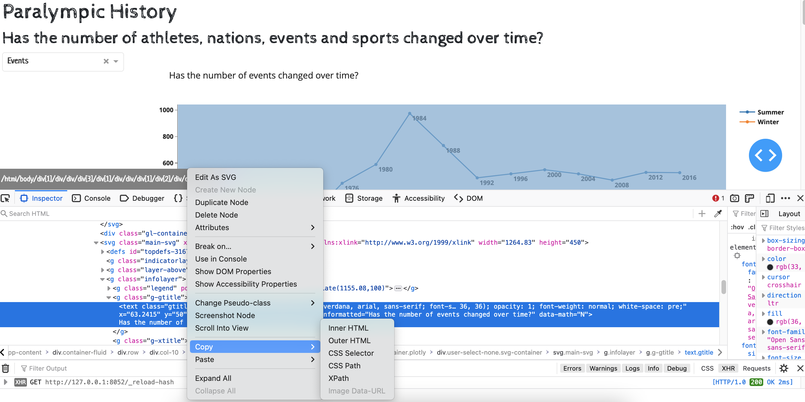

# Testing Dash apps

Contents:

- [Activity introduction](#activity-introduction)
- [Setup](#setup)
- [End to end testing with Selenium](#end-to-end-testing-with-selenium)
- [Create GitHub actions workflow](#create-a-github-actions-workflow-that-runs-the-selenium-browser-tests)
- [Create tests for the paralympics app](#create-tests-for-the-paralympics-app)

## Activity introduction

This activity will introduce you to testing a Dash app using pytest and Selenium webdriver. You will test the Dash app in the `src/apps/recycle_app` directory.

The activity assumes you completed the setup instructions in README.md. If you have not, please do so before starting otherwise you are likely to experience issues with imports during testing.

In COMP0035 you learned how to use pytest to create tests. This style of testing would be useful to test the functions in `recyclingchart.py` and `recyclingdata.py`. However, the structure of Dash (or any web app) is such that it would be difficult to create unit tests in the same way.

A more useful approach for the Dash app would be to test components, or integration testing. That is, to run the Dash app and test that it can be used to complete the functions you defined in your user stories or use cases (in the COMP0035 coursework 2).

To do this you will use an additional library called Selenium (Selenium webdriver). Selenium allows you to run tests automatically in the browser, that is you simulate the behaviour of a user carrying out specific actions in the browser and then use assertions to verify particular conditions or state.

Dash provides support for testing Dash on Chrome using Selenium. To do this also requires you to install [ChromeDriver](https://sites.google.com/chromium.org/driver/home?authuser=0) which allows Selenium to navigate and interact with webpages in the Chrome browser. This is installed separately from Selenium and guidance is given in the activities below.

Selenium can be used with a number of test libraries, we will use pytest since you used this in COMP0035, and it is recommended in the Dash documentation.

You should refer to the [Selenium documentation](https://www.selenium.dev/documentation/webdriver/) for the syntax [locating elements](https://www.selenium.dev/documentation/webdriver/elements/) on a webpage and [interacting with them](https://www.selenium.dev/documentation/webdriver/elements/interactions/).

Dash testing's `dash_duo` provides some convenience functions, i.e. shortcuts to the Selenium functions. These are [documented here](https://dash.plotly.com/testing#browser-apis).

**NOTE: Coursework 1 Dash app testing is only required for groups**

## Setup

### Install the testing packages

Enter `pip install pytest selenium pytest-cov dash[testing]` in a terminal/console within your venv.

### Download and install the correct version of Chromedriver for your computer

You will need to use the [Chrome browser for testing Dash](https://dash.plotly.com/testing), though Selenium supports a
number of browsers.

Check your version of Chrome in the Chrome settings/preferences 'About Chrome'.

Go to [Chrome driver downloads](https://sites.google.com/chromium.org/driver/downloads) and select the version for your
version Chrome.

In the next window you then need to download the correct driver for your operating system.

The [Selenium documentation](https://www.selenium.dev/documentation/en/webdriver/driver_requirements/) explains where to place it in Windows and how to add it to the path, and for macOS.

My experience on a MacBook was that I had to complete the following steps:

- Download the driver
- Try to open the driver from the download directory, this prompts you to change the security settings for the file (
  System Settings | Security & Privacy | General and then click on 'Open Anyway').
- Close the driver
- Move the driver from downloads to `usr/local/bin`  (I use this location as it is already in PATH)

### Configuring the Chrome driver

You do not need to explicitly create and declare the Selenium webdriver when using dash.testing. This is created for you using the Chrome driver. If you want to use a different driver e.g. Firefox, you will need to read the [Plotly Dash documentation](https://dash.plotly.com/testing) for how to do this.

You will need to configure the Chrome driver, especially if you want to run the tests in GitHub Actions.

Go to `test/conftest.py` and comment out (i.e. add a `#` before) the headless and gpu options now. If you don't do this you won't see the tests running in the browser on your computer. Remember to remove the `#`s again before you push changes to GitHub.

```python
from selenium.webdriver.chrome.options import Options


def pytest_setup_options():
    options = Options()
    # Uncomment the following if testing on GitHub actions, the browser needs to run in headless mode
    options.add_argument('--disable-gpu')
    options.add_argument('--headless')
    return options
```

## End to end testing with Selenium

### Test code structure

Boilerplate code for creating a test is given in the Dash documentation.

This was used when writing [test/test_recycle_app/test_recycle_app.py](/test/test_recycle_app/test_recycle_app.py)`. Open this file now before reading the rest of this document.

### Name the test

In the documentation the test function name follows this pattern: test_{tcid}_{test title}.

The test case ID (tcid) is an abbreviation pattern of mmffddd => module + file + three digits.

You do not have to follow this pattern if you are following a different naming convention for your tests. As you should
remember from COMP0035 it is a good idea to start with `test_` as many test runners will autodetect tests based on this
naming pattern. The name of the test should also indicate what the test does.

I have used a slightly different 'tcid' using an abbreviation for the app plus 3 digits.

You should see that the first test is named `def test_rec001_h1textequals(dash_duo):`

## Create the dash app

The boilerplate code suggests that you define and create the app in every test case. This would lead to a lot of
repetition and become difficult to maintain. Instead, create the app by using the `import_app` function which is in the
application_runners module, this only works if the file that runs the dash app is
called `app.py` ([see community post here](https://community.plotly.com/t/how-you-can-integration-test-your-app-by-dash-testing/25002)):

```python
from dash.testing.application_runners import import_app


def test_spa001_h1textequals(dash_duo):
    app = import_app("apps.recycle_app.recycle_app")
```

The docstring for the `import_app` function explains how to reference your dash app:

```python
"""Import a dash application from a module. The import path is in dot
    notation to the module. The variable named app will be returned.

    :Example:

        >>> app = import_app("my_app.app")

    Will import the application in module `app` of the package `my_app`.

    :param app_file: Path to the app (dot-separated).
    :type app_file: str
    :param application_name: The name of the dash application instance.
    :raise: dash_tests.errors.NoAppFoundError
    :return: App from module.
    :rtype: dash.Dash
    """
```

Further, you could create a fixture in `conftest.py` to create the app and then use in your test functions if you prefer:

```python
from dash.testing.application_runners import import_app


@pytest.fixture(scope="function")
def run_recycle_app(dash_duo):
    app = import_app("apps.recycle_app.recycle_dash_app")
    yield dash_duo.start_server(app)
```

### Waits

Selenium webdriver loads the web app, however the tests could run before the page has finished rendering and a test may fail as a given element was not yet available. To avoid this you can
use [waits](https://www.selenium.dev/documentation/webdriver/waits/), either to wait for a set period of time or to wait for a particular event on the page.

In the first test we wait for the first `<h1>` element to be available:

```python
dash_duo.wait_for_element("h1", timeout=4)
```

You can also access the [implicit waits](https://www.selenium.dev/documentation/webdriver/waits/#implicit-wait) by using `dash_duo.driver` which exposes the methods from the selenium API. For
example: `dash_duo.driver.implicitly_wait(5)`

### Find an element and property to check

In the first test, the nest step is to find the text value of the h1 heading like this:
`h1_text = dash_duo.find_element("h1").text`.

Finding an element, or all elements, can be done using tags, ids, classes.
The [location strategies are explained in the documentation](https://www.selenium.dev/documentation/webdriver/elements/) along with examples of Python code.

As well as finding an element, you can also interact with an element, for example fill in details of a form, click on a link or a button. Some of these are shown in the example tests in `test_recycle_app.py` and there are further examples in the [selenium documentation](https://www.selenium.dev/documentation/webdriver/elements/).

### Write the assertion(s)

We covered writing assertions in COMP0035. If you recall, pytest uses `assert` for most assertions (rather than different assertion types such as assert_equal, assert_contains etc.).

For the first test we 'assert' that the text in the `<h1>` element includes the text 'Waste and recycling'. However, the bootstrap style that is applied to this element converts the text to uppercase, so the test would fail.

Instead, a step has been added to compare the strings ignoring the case using the python function `.casefold()`. There are other techniques you could use such as `.upper()`, `.lower()`, or REGEX pattern matching.

```python
h1_text = dash_duo.find_element("h1").text
assert h1_text.casefold() == 'Waste and recycling'.casefold()
```

### Run the tests

Run the tests using the appropriate pytest run method for your IDE (covered in COMP0035) or from the terminal e.g.:

```python -m pytest -v```

### Add a test

Try and add at least one more test to `test_recycle_app.py`.

## Create a GitHub Actions workflow that runs the selenium browser tests

The use of GitHub Actions for automatically running tests was covered in COMP0035. You could also apply this to run the Dash tests automatically.

The GitHub Actions steps are not repeated in full here (see COMP0035 or use GitHub documentation).

- Go to your GitHub repository and find the Actions tab
- The Getting Started... screen provides an option to search, search and find 'python application' then select Configure on that option in the search results
- A workflow definition in YAML is created. You will need to make a few changes:
  - You may wish to change the workflow name
  - Change the version of Python that is used to match the version you are using to develop
  - You don't need to install ChromeDriver as the default environment in GitHub already installs this for you.
  - Change the line of code that runs the pytest to `python -m pytest` and not simply `pytest`. This
      is [explained here](https://docs.pytest.org/en/6.2.x/goodpractices.html#tests-outside-application-code).
- Select 'Start commit' once you finish editing the workflow.
- Go back to the Actions tab. The workflow is likely to be still running, once it finished click on it and expand the build steps to check there are no errors.

Remember: the code to set the chromedriver options needs to be changed for GitHub Actions!

```python
from selenium.webdriver.chrome.options import Options


def chrome_setup_options():
    options = Options()
    # Uncomment the following if testing on GitHub actions, the browser needs to run in headless mode
    options.add_argument('--disable-gpu')
    options.add_argument('--headless')
    return options
```

## Create tests for the paralympics app

Use the documentation:

- [Selenium documentation](https://www.selenium.dev/documentation/webdriver/) for the syntax [locating elements](https://www.selenium.dev/documentation/webdriver/elements/) on a webpage and [interacting with them](https://www.selenium.dev/documentation/webdriver/elements/interactions/).
- [dash_duo convenience functions](https://dash.plotly.com/testing#browser-apis), ie shortcuts to the selenium functions.

### 1: Create a test file for the paralympic app

In the `test` folder create an appropriately named python folder and file for adding the paralympic tests to.

### 2: Create any additional fixtures

Consider if you need a separate `conftest.py` for the tests for this app; or whether to add fixtures to the existing conftest.py in the root of the `test` folder.

### 3: Write a test to check the home page title

Hint: Look at the first test in `test_recycle_dash_app.py` for guidance as to the test structure.

```python
"""
    GIVEN the app is running
    WHEN the home page is available
    THEN the H1 heading element should include the text 'Paralympic History'
    """
```

Run the test and make sure it runs and passes.

### 4: Write more tests

To determine the elements you can test for on a page, first run the app, select an element of the page and then use your
browser's option to view the page source. If you expand on the selection in the Inspector pane, find the element
you are interested in, then right click and there are options to copy aspects such as CSS selector or XPath.


To find an element by xpath you will need to use Selenium locators instead of the dash_duo.find_element e.g.

```python
dash_duo.driver.find_element(By.XPATH, "/html/body/div[1]/div/div/div[3]/div[1]/div/div/h1")
```

Write tests for as many of the following as you can.

```python
"""
GIVEN the Dashboard page has loaded
WHEN the value Athletes is selected from the dropdown with the id 'type-dropdown'
THEN the chart with the id `fig-line-time` should change so that the title includes the words 'participants'
"""

"""
GIVEN the Dashboard page has loaded
WHEN both the Winter and Summer options in the checklist with the id 'mf-ratio-checklist' are unselected
THEN the divs with the ids of 'stacked-bar-gender-win' and 'stacked-bar-gender-sum' should have a `style="display: none"' attribute
"""

"""
GIVEN the Dashboard page has loaded
WHEN the gold medals table is displayed
THEN the text value of the table heading (<th>) in the first column should be 'Country'
"""
```

## 5: Run the tests using GitHub Actions

You will need to change the options for the chromedriver so that it runs in headless mode with gpu disabled. Check the
chrome options in `conftest.py`.

Commit and push your tests to GitHub.

Go to the Actions tab in GitHub and check the workflow results.
